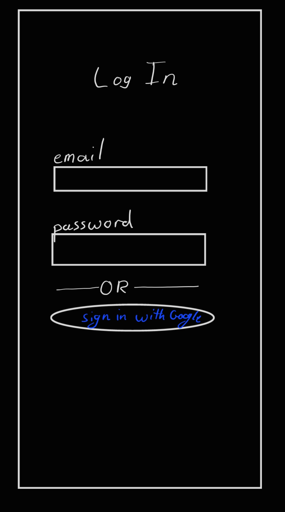
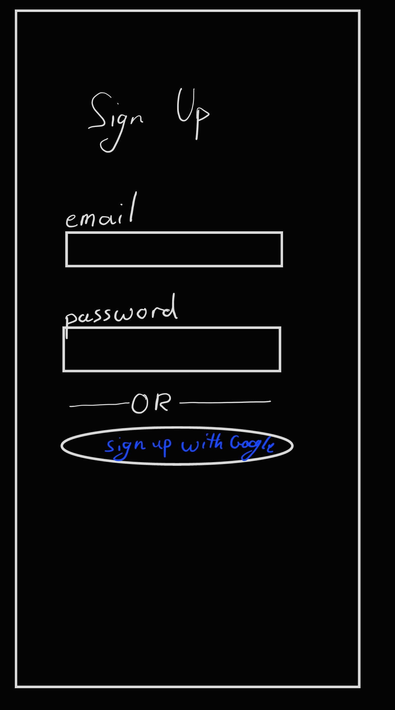
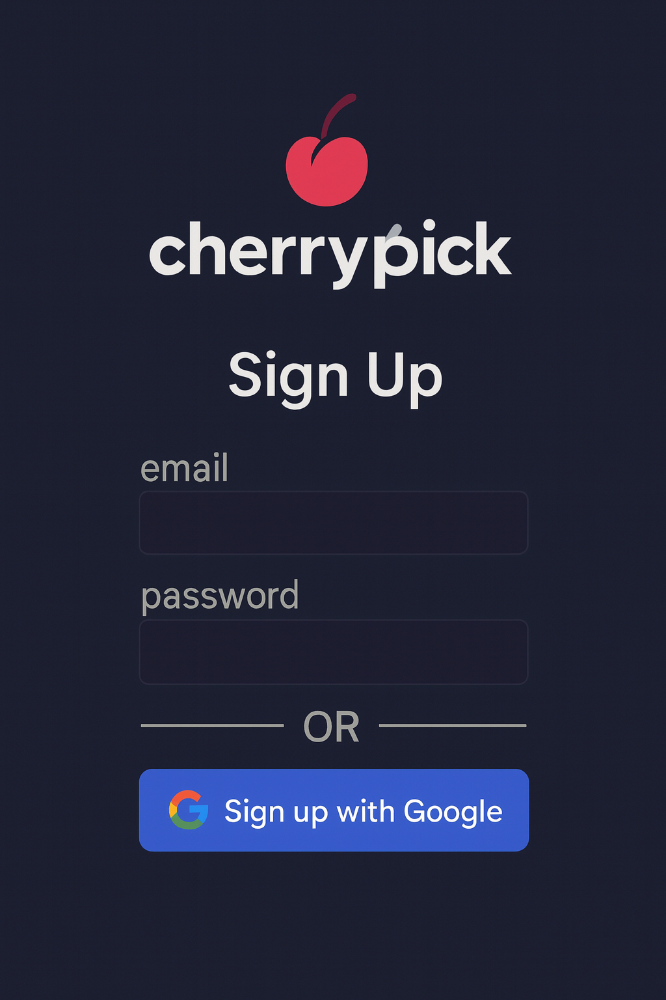
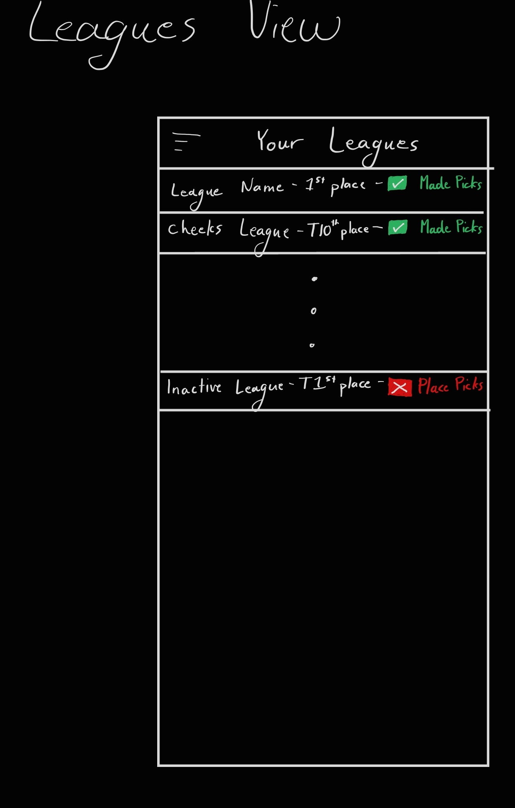
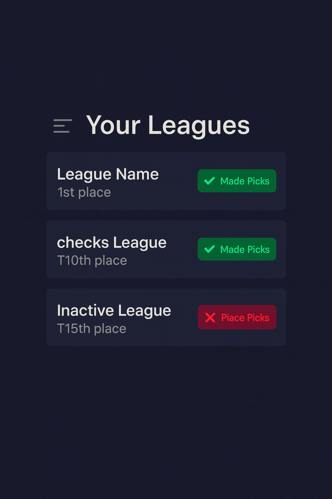
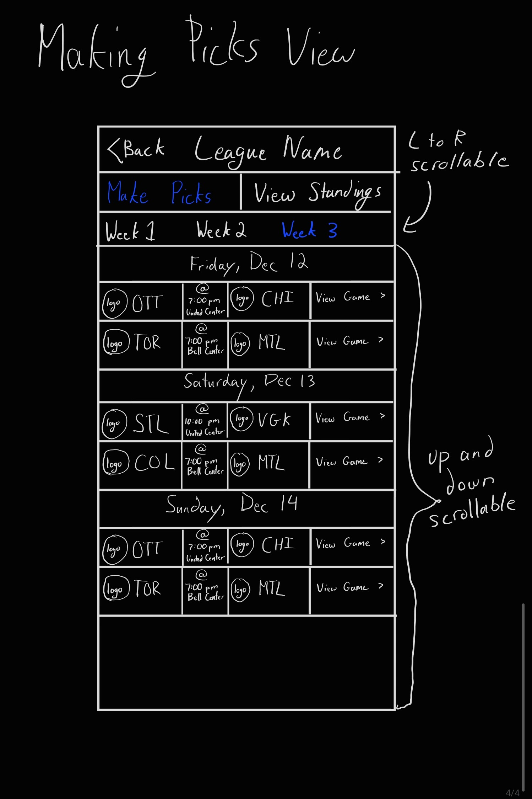
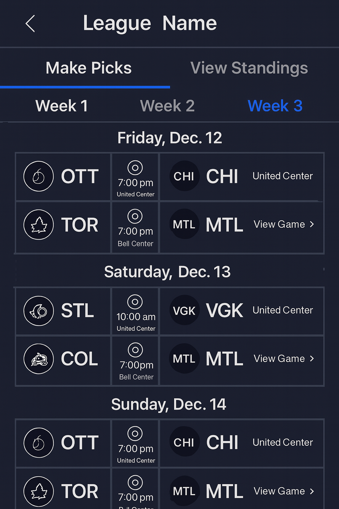

# Cherrypick 🍒

## Goal 🎯:

A fantasy hockey pick 'em game for mobile.

It will be a cross-platform application for iOS and Android. The app will be as easy to use as possible.

The user will first log-in then will be taken to their dashboard for all the leagues they are in.

They will then select a league and make all their picks for who will win the game. Eventually, it will have an update so users can choose who will cover the spread instead.

Each league will feature cummulative rankings across the entire NHL season.

Each user will pick for every Friday, Saturday, and Sunday game on the NHL schedule. This was a design choice to not overwhelm users.

## Tech Stack:

- Mobile Front-End: Flutter
- Databases: Firebase
- Middleware: Local Server -> Raspberry Pi

## Back-End 

### Overview

The only database we will use is Firebase. If our needs change later on (high demand, advanced analytics, etc.) we can move to a SQL database, but for now a NoSQL database like Firebase works great.

We will have the following tables:

- authentication
- teams
- games
- leagues
- users

Each table has a subheader following the overview.

### Table: Authentication

This table is unique in that it stores user authentication data but is handled entirely by Firebase itself. I don't know if we actually can/need to query to it directly.

### Table: team0s

This table houses documents for each team. The ID is the three letter team abbreviation (ex. Chicago Blackhawks --> `CHI`)

This table has the following fields for each document:

```
{
    conference,
    division,
    gamesPlayed,
    losses,
    otLosses,
    pointPctg,
    points,
    wins
}
```

This data is all updated from the publicly available official NHL API at 3:30am every night (Eastern).

### Table: games

This table houses every NHL game that is played on every Friday, Saturday, and Sunday of the regular season. The games are grouped by week.

The document identifier is the week number (as a string), starting at 1 for the first week of the season, only incrementing to the next week if there is at least one game on the Friday, Saturday, or Sunday of that week.

This table has the following fields following a nested structure:

```
{
    gameID:
    {
        away: awayTeamAbbreviation,
        awayScore: final away score/"NULL" if the game has not started,
        home: homeTeamAbbreviation,
        homeScore: final away score/"NULL" if the game has not started,
        dayOfWeek: "FRI"/"SAT"/"SUN",
        endingPeriod: "REG"/"OT"/"SO",
        gameState: "FUT"/"LIVE"/"OFF"/etc.,
        startTimeUTC: as a string,
        venue: where the game is being played
    }
}
```

### Tables: leagues

Being built

### Tables: users

Being built

## Front-End - UI Samples

Each screen will have a hand-drawn schematic and an AI-created example that is built off of the schematic drawn. When there are any conflicts between the two, go off of the schematic, not the AI-drawn example.

### Log In Screen

Users should be first greeted with the log in screen if they are not already logged in. There will be an option to use Google OAuth to sign in or continue to the sign up page (that is not shown on either image but should be present).




### Sign Up Screen

If the user had no account and needed to create one, they will be taken to the sign up screen from the log in screen. There should be an option to go back to the log in screen (but is not pictured in either the schematic or the ai-drawn picture).





### Leagues Screen

The user will be taken to this screen after initial log in or launch (if they are already logged in.) It will feature a list of every league the user is in, and a menu in the top right corner. On this view, there will be a status indicator coupled with an emoji.

We will have the following status indicators:

- ✅ All picks made (in green, user has make all of their picks)
- ❎ Make picks now (in red, user hasn't make any picks and no games have started)
- 🫠 Picked late (in yellow, this is when some games have already started but the user made all the picks they still can)
- 😢 Missed picks (in blue, the week has ended and they didn't make their picks)
- 😲 Games Started! (in orange, user hasn't made any picks but games have started)

Clicking on any given league will take the user to the make picks screen for that given league.

The AI drawing is pretty bad for this screen.




### Picks Screen

This will be the screen where users are able to make their picks for each week. The schematic and the following AI drawing are drawings of a non-functional version. The functional parts will be described at a later date. 

Users will be able to scroll left and right through the weeks, with it focusing on the current week by default. The users will also be able to scroll up and down through the list of games for that given week. The week selection bar and above should all be static, the only scrolling should happen below it.

The user will also be able to select the standings screen for this league from this page. They are also able to select *View Game* that will give a more advanced run down of the game (with potential future advanced statistics??? NHL Edge API integration???)

**Please Note:** The grid lines in the schematic (and around the games in the ai drawing) should be *implied*, not actually rendered on the UI. Also, times should be set to the user's local time.




## Credits:

So far just Adam Montgomery, with Andrew Leech and Benjamin Probert on the way.

All NHL data supplied by the NHL Official API.